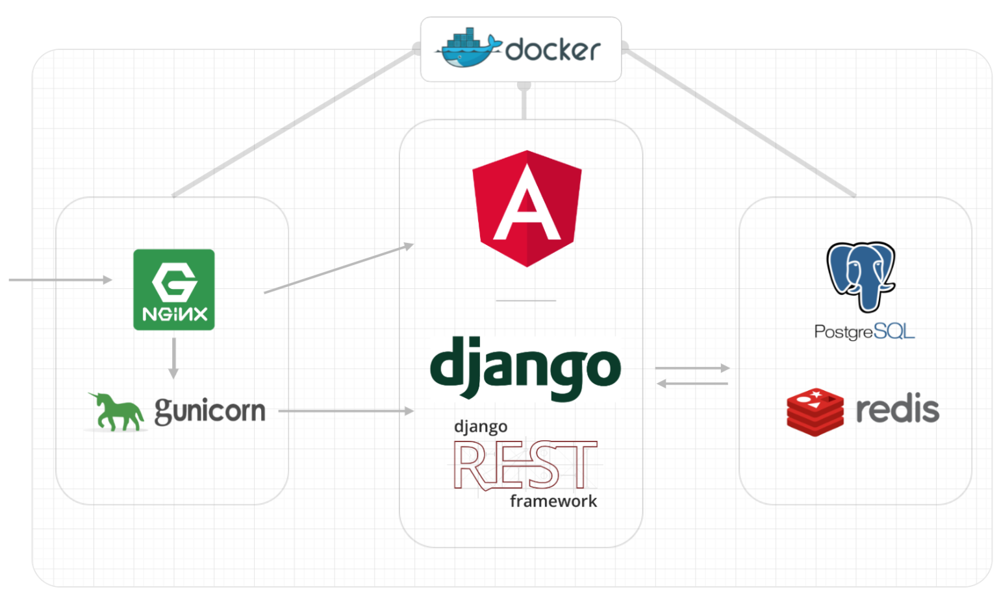

## Coinsim - Social Crypto Trading Platform

Coinsim is a simulated social trading platform, where users can buy and sell cryptocurrencies and compare each others wallets. It is built on open source web technologies and currently runs at [coinsim.io](http://www.coinsim.io) on [Amazon Elastic Container Services](https://aws.amazon.com/de/ecs/)

### Get Started

* `git clone https://github.com/coinsim-labs/coinsim && cd coinsim`
* Windows only: `move env.win env`
* `docker-compose build`
* `docker-compose up -d`
* `docker exec -it coinsim_web_1 python mockdata.py` (creates mockdata for testuser)
* Open http://localhost/ in browser
	* Login with username: "user", password: "user"
	* For API documentation: http://localhost/api/v1/docs/

### Note to Windows users
Make sure you clone the repo "as-is" and have git `core.autocrlf` set to `false`. 
Otherwise you will get into problems because of Windows-style line endings.
You can set it manually with `git config --global core.autocrlf false`

Use the `env.win` environment variables file (`move env.win env`)

### Coinsim web stack
